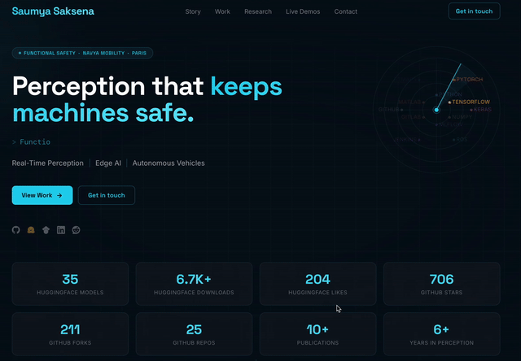

# Portfolio Template

A single-page developer/researcher portfolio. Vite + React 18 + Tailwind CSS + Framer Motion, with a few sections wired to live public APIs (GitHub, Hugging Face, Semantic Scholar) instead of hardcoded numbers.

<p align="center">
  
</p>

Built for [**saumyasaksena.com**](https://saumyasaksena.com/) — free to fork and reuse as a template.

## Stack

- **Vite 7** — build tool
- **React 18** — UI
- **Tailwind CSS 3** — styling
- **Framer Motion 11** — animation / scroll-reveal
- **react-type-animation** — the Hero role-typewriter
- **@fontsource** — self-hosted Space Grotesk + Inter (no Google Fonts request)

## Quick start

```bash
npm install
npm run dev       # http://localhost:5173
npm run build      # outputs to dist/
npm run preview    # serve the production build locally
```

## Folder structure

```
src/
├── main.jsx              # React entry point
├── App.jsx                # page layout — section order lives here
├── index.css              # Tailwind layers + hand-written CSS (glass-card, buttons, keyframes)
│
├── components/            # one file per page section, self-contained
│   ├── Nav.jsx             # fixed header, scroll-spy-free anchor nav, mobile menu
│   ├── Hero.jsx            # headline, role typewriter, live stat row, radar visualization
│   ├── Story.jsx           # career/timeline arc — reads data/experience.js
│   ├── Skills.jsx          # tech stack grid — reads data/skills.js
│   ├── Projects.jsx        # project cards w/ live GitHub stars — reads data/projects.js
│   ├── LiveDemos.jsx        # embedded Hugging Face Space iframes — reads data/demos.js
│   ├── Publications.jsx     # papers/patents w/ live citations — reads data/publications.js
│   ├── Contact.jsx          # contact link grid
│   └── Footer.jsx
│
├── data/                   # ← content lives here, edit these, not the components
│   ├── experience.js        # story[] — the Story timeline
│   ├── skills.js             # skills[] — name/color/icon path per skill
│   ├── projects.js           # projects[] — featured project cards
│   ├── demos.js               # demos[] — embedded HF Space URLs
│   ├── publications.js        # publications[], patents[], authorStats — papers section
│   └── committees.js           # committees[] — service/leadership roles (not yet wired to a component)
│
└── hooks/                   # live-data fetchers, each with localStorage caching + static fallback
    ├── useGitHubStats.js      # useGitHubRepo, useGitHubProfile, useGitHubTotalStars
    ├── useHFStats.js           # useHFStats (aggregate), useHFModel (single repo)
    └── useSemanticScholar.js   # useSemanticScholar — batched citation-count lookups
```

Top-level: `index.html`, `vite.config.js`, `tailwind.config.js` (palette, fonts, keyframes), `vercel.json` (SPA rewrite), `public/favicon.svg`.

## Editing content

Everything a fork actually needs to change lives in `src/data/*.js` — the components themselves shouldn't need edits for a content update:

| File | Controls |
|---|---|
| `data/experience.js` | Career timeline nodes shown in Story |
| `data/skills.js` | Tech stack icons/colors shown in Skills |
| `data/projects.js` | Featured project cards |
| `data/demos.js` | Embedded live demo Spaces |
| `data/publications.js` | Papers, patents, and the author-stats line |

Section order and which sections render at all is controlled in `src/App.jsx`. The `Skills` section is currently commented out there — uncomment it to bring it back.

Colors, fonts, and custom keyframes (radar sweep, pulse-dot, shimmer) are in `tailwind.config.js`; component-level CSS classes (`.glass-card`, `.btn-primary`, `.tag-pill`, etc.) are in `src/index.css`.

## Live data

Several sections fetch real numbers client-side instead of using static copy, each with a `localStorage` cache and a static fallback if the API call fails:

- **GitHub** — stars/forks per repo, and account-wide totals (unauthenticated: 60 req/hr)
- **Hugging Face** — per-model downloads/likes, and account-wide totals
- **Semantic Scholar** — citation counts, batched into a single request per page load to stay under their per-IP rate limit

## Deploy

Framework preset: **Vite**. Build command `npm run build`, output directory `dist`. `vercel.json` rewrites all routes to `index.html` for client-side routing — this repo deploys to Vercel out of the box, but the same build output works on any static host.

## License

Apache License 2.0 — see [LICENSE](./LICENSE).
